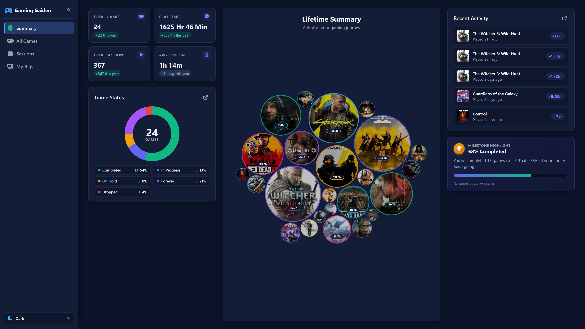
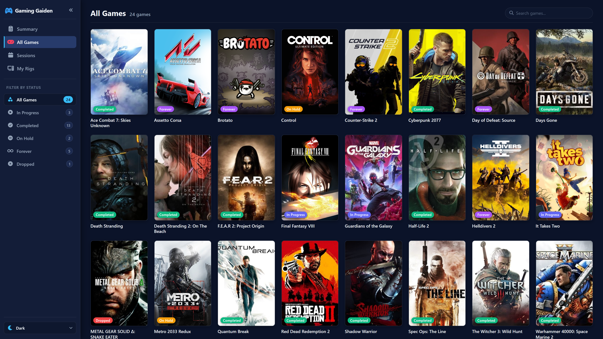
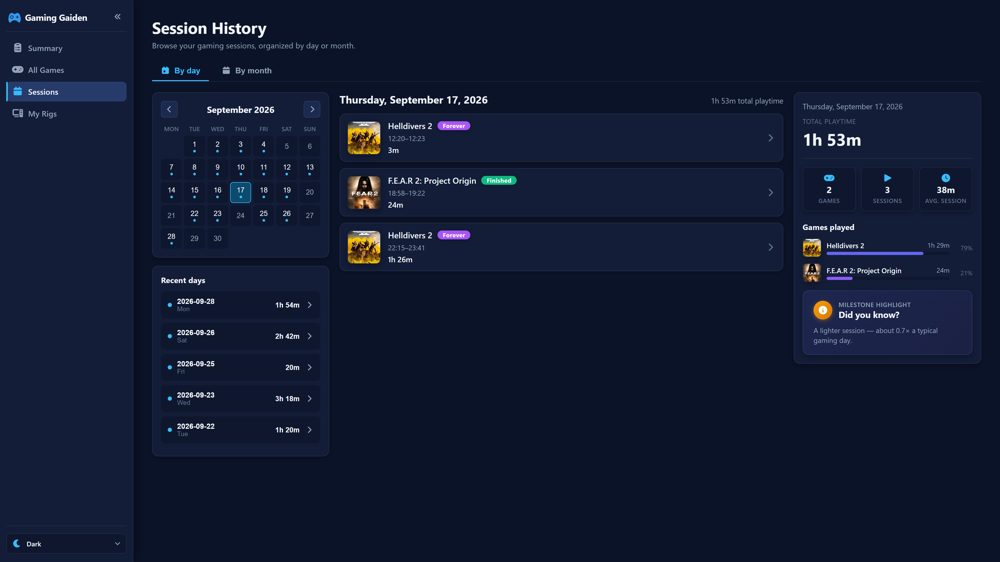
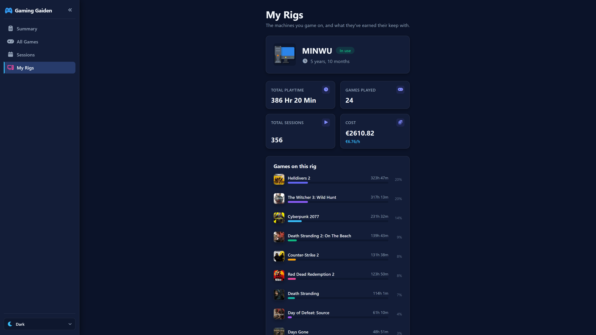

### 外伝 (Gaiden)

Japanese

noun (common)

A Tale; Side Story;

A small PowerShell tray application for Windows that tracks your gaming time — quietly, in the background —
and tells the story of your gaming years back to you through a fast, modern dashboard.

> Gaming Gaiden was originally created by [Kulvinder Singh](https://github.com/kulvind3r/GamingGaiden). This
> repository continues that work, keeping the lightweight PowerShell tracker at its heart while replacing the
> original static reports with a rebuilt next-generation single-page frontend. All credit for the foundation
> — and the lovely name — goes to Kulvinder. 🙏

## The dashboard

Left-click nothing, install once, and play. Whenever you want to see where your time went, **double-click the
tray icon** and Gaming Gaiden opens a fast, offline, browser-based dashboard rendered entirely from your local
database.

### Summary — your gaming life at a glance
Lifetime totals, a completion donut, a bubble field of your library sized by playtime, and a live recent-activity feed.

### All Games — the whole library, searchable
A poster wall with status pills (Completed / In Progress / On Hold / Forever / Dropped), instant search, and status filters.

### Sessions — browse by day or month
A navigable calendar, per-day session breakdowns, a games-played ranking, and playful "did you know?" insights and milestones.

### My Rigs — value for money, per machine
Every gaming PC you own, its age and lifetime playtime, and a real **cost-per-hour** so you know what each rig earned its keep with.

The whole UI ships with light and dark themes and remembers your choice.

## Features

- #### Time Tracking
    - Tracks play time & session history for PC games automatically — no manual timers.
    - Out-of-box HWiNFO64 integration exposing session time and tracking status as sensors.
    - Install on multiple gaming PCs and share one database to track games and hours per machine.
- #### Dashboard & Statistics
    - Fast, offline single-page dashboard: **Summary**, **All Games**, **Sessions**, and **My Rigs**.
    - Lifetime summary, monthly/yearly analysis, most-played games, and a per-game detail view.
    - Value-for-money analysis per rig (gaming cost per hour / per month).
    - Mark games as In Progress / Finished / On Hold / Dropped / Forever to track backlog completion.
    - Add and edit games straight from the dashboard — the **(+)** button on All Games and **Edit** on a game's
      detail page open the entry dialog. Backfill legacy games you no longer have installed by leaving the
      executable blank and entering the playtime by hand.
    - Light & dark themes with your preference remembered.
- #### Quality of Life
    - Small and fast — light on CPU & RAM, sub-5-second game detection.
    - Completely offline and portable; all data lives in a local database.
    - Automated data backup after each gaming session.

> [!WARNING]
> Gaming Gaiden is only available for download from this GitHub repository. Any copy available elsewhere could be malicious.

## How to install / upgrade / use
1. Open a PowerShell window as admin and run the command below to allow PowerShell modules to load on your system. Choose `Yes` when prompted.
    - `Set-ExecutionPolicy -ExecutionPolicy RemoteSigned -Scope CurrentUser`

2. Download ***GamingGaiden.zip*** from the [latest release](https://github.com/MrFranksJr/GamingGaiden/releases/latest).
3. Extract the ***GamingGaiden*** folder and run `Install.bat`. Choose Yes/No for autostart at boot.
4. Use the shortcut on the desktop / start menu to launch the application.
5. **Double-click the tray icon** to open the dashboard; **right-click** for the menu (Settings, Start/Stop Tracker, About).
6. Regularly back up your `GamingGaiden.db` and `backups` folder to avoid data loss. Use ***Settings => Open Install Directory*** in the tray menu to find them.

## Development and Deployment
If you are modifying Gaming Gaiden and want to quickly deploy your changes to the live installation:

1. **Deploy.bat (Recommended)**: Double-click `Deploy.bat` in the root directory. This will:
    - Stop the running `GamingGaiden.exe`.
    - Run `Build.ps1` to re-generate the executable (which includes building the frontend).
    - Sync all source files (`modules`, `icons`, `frontend`) to `C:\ProgramData\GamingGaiden`.
    - Automatically restart the application.

2. **Manual PowerShell**: Run `.\Deploy.ps1` from an elevated PowerShell terminal.
    - Use `.\Deploy.ps1 -NoBuild` for near-instant updates of scripts or frontend files without re-building the `.exe`.

The frontend is a TypeScript single-page app under `frontend/` (built with `esbuild`, tested with Vitest).
The PowerShell backend exports the database to a JSON payload the frontend renders; see
`docs/features/FrontendDataContract.md` for the contract.

### Rolling back after a deploy

Each deployment automatically backs up `GamingGaiden.db` before copying any files (stored as a timestamped zip in the `backups` folder). To roll back:

1. Stop Gaming Gaiden (exit from the tray icon or close the process).
2. Open the install directory (`C:\ProgramData\GamingGaiden\backups`).
3. Find the backup zip from just before the bad deploy (named `GamingGaiden-dd-MM-yyyy-HH.mm.ss.zip`).
4. Extract `GamingGaiden.db` from the zip and copy it into `C:\ProgramData\GamingGaiden`, replacing the current database.
5. If you also need to revert the application files, re-run `Deploy.bat` from the previous version of the source code (e.g. check out the earlier commit with `git checkout`).
6. Restart Gaming Gaiden.

> **Note:** Only the 5 most recent backups are kept. If you need to preserve a specific backup long-term, copy it to another location.

## How to uninstall
Run `Uninstall Gaming Gaiden` from the `Gaming Gaiden` start menu folder. `GamingGaiden.db` and `backups` are not removed, to preserve your data.

## Unknown Publisher
Windows SmartScreen may warn that the application is from an ***Unknown Publisher*** because it lacks a signature from a public CA.
Signing costs for apps are hundreds of dollars per year. Can't afford them.

## Antivirus False Positives
> :hearts:
> Antivirus false positives are hard to fight.
> If you have found the app useful and safe, please leave a star on GitHub to increase trust.

Gaming Gaiden performs the following tasks that resemble common malware behavior, which can lead to it being flagged by antivirus software:

- Scanning running programs to detect and track games.
- Adding registry entries for HWiNFO64 integration.
- Periodically sleeping to conserve resources.
- Packaged as an executable using ps12exe.

Its PowerShell-based implementation also raises flags, as PowerShell scripts can be used maliciously and have low trust in the tech community.

Antivirus tools flag such behavior to keep users safe without verifying actual malicious activity. Fixing false positives requires manually requesting antivirus providers to unflag Gaming Gaiden, or rewriting it in a compiled language like C#. Even then there is no guarantee of a fix, given that its core function is process scanning.

The source code is open and available for anyone to review and ensure nothing wrong is happening. Users are responsible for their own safety and actions when using the program.

Please remember that open-source software comes without any support or warranties.

## Attributions

Originally created by **[Kulvinder Singh](https://github.com/kulvind3r/GamingGaiden)** — thank you for the
foundation and the name.

Made with love using

- [PSSQLite](https://www.powershellgallery.com/packages/PSSQLite) by [Warren Frame](https://github.com/RamblingCookieMonster)
- [ps12exe](https://github.com/steve02081504/ps12exe) by [Steve Green](https://github.com/steve02081504)
- [D3](https://d3js.org/) by [Mike Bostock](https://github.com/d3)
- [Font Awesome Free](https://fontawesome.com/) by [Fonticons](https://github.com/FortAwesome/Font-Awesome)
- Various Icons from [Icons8](https://icons8.com)
- Game Cartridge Icon from [FreePik on Flaticon](https://www.flaticon.com/free-icons/game-cartridge)
- Cute [Ninja Vector by Catalyststuff on Freepik](https://www.freepik.com/free-vector/cute-ninja-gaming-cartoon-vector-icon-illustration-people-technology-icon-concept-isolated-flat_42903434.htm)
